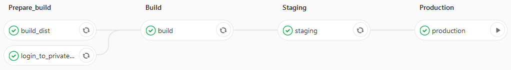

The hard way is a path focused on learning, you should follow/replicate this if your aim is gaining knowledge. This post will serve as an overview, while going into a bit more details for sections where there's no separate post planned. Expect a lot of deep dives searching, especially if you do it before the detailed posts are available.

If you're more interested in the end result, follow these steps instead:
1. Sign up for a hosted blog on ghost.org (atleast that's the service I'd pick)
2. Buy a domain name
3. Sign up for a free Cloudflare account
4. Configure Cloudflare in front of your blog for some free goodies

# Overdoing infrastructure
First off, the reasonable hardware for running this blog and servicing the anticipated traffic is the equivalent of a raspberry pi, I probably can't serve more traffic with this considering my uplink, but it's serving it's purpose of experimentation and learning well.

## Hardware
You should get a mimimum of 2 hosts, Dell Poweredge r710 are a good choice, they're really cheap(<€100 for a low spec one), can be upgraded to 2x 6core@3.46Ghz, 288GB ram and compared to many alternatives they're pretty quiet. There's no need to actually go with servers, but you're going to want some kind of setup that has a minimum of 32GB ram.

The VMs discussed throughout this post are using ~23GB on my cluster, but in total I'm using 81GB after a year of experimentation, so if you can get a bit more it'll leave you more room for further experimentation.

## Network setup (DMZ)
Setup a separate network (DMZ) and start it off by not allowing anything other than outbound internet access (nothing inbound yet), pick a subnet (so you can specify rules specifically for them) and put your hosts in it. Make sure to also configure DNS in this step (so you don't have to remember IPs for all your hosts and VMs).

## Optional: automate setting up a bare-metal Kubernetes cluster
Using [Matchbox](https://github.com/coreos/matchbox) you can control PXE/ignition provisioning on physical(or virtual) hosts using terraform. I went with [typhoon](https://github.com/poseidon/typhoon) as a base to provision a Kubernetes cluster. I ended up scrapping it again, but I learned a lot about TFTP and PXE doing this.

The main reason for scrapping it was that it didn't feel flexible enough, so I kept digging around a bit and found that VMWare vSphere can be controlled by terraform. So let's give that a try.

## Setup ESXi on hosts
Automating this using matchbox would be a good idea. I actually did it manually though (shame on me!), I'll fix that at some point. It's pretty straightforward, no different than installing any other OS, so get it done and give them DNS entries so you don't have to remember them by IP.

## Provision Gitlab for source control
Yes, you could just put this on Github, but that would be cheating ;). Start off by creating a VM, 2vCPU, 8GB RAM and 20GB HDD should be enough for quite a while (mine's currently using 200Mhz, 1.5gGB RAM and 5GB HDD). Install [Gitlab](https://about.gitlab.com/install/) on it and give it a DNS entry. Use certbot with your challenge of choice (Cloudflare for example) for giving it a TLS certificate (it's nice to have and it's also going to be the easiest path for getting Gitlab Container Registry working later on). The harder path for getting Container registry working is also less secure.

## Provision Gitlab runner
You'll also want runners for running both infrastructure and application deployment pipelines. I went for a [docker service](https://docs.gitlab.com/runner/install/docker.html), so that docker images can be used for steps. You might be tempted to use Kubernetes runners for application deployment pipelines, but you'll need privileged containers to be able to run Docker in Docker steps, making it impossible to run them on a secure Kubernetes cluster.

Now you've got source control and a means to running pipelines when code is pushed, make sure to set up repositories and pipelines for upcoming steps.

## Provision Kubernetes cluster
Remember to create a repository for this and hook up a pipeline. You should now automate provisioning your Kubernetes cluster. I went with [Kubespray](https://github.com/kubernetes-sigs/kubespray), creating the VMs for hosts using the VMWare provider and having the ansible inventory files as terraform templates so that they can be generated and populated by terraform.

Important: make sure to create a multi-master cluster, switching from single to multi-master is a bit of a pain and with single-master you can't do updates without downtime.

This isn't as nice to work with as kops, but it works. Please let me know if you find something that works better, I'm not completely satisfied with this setup. There are plans to support vSphere in kops, so might be worth looking into that before diving too deep into this setup.

## Configure cluster
Configure ingress controller, network policies, users/roles and namespaces using terraform and the kubernetes provider. It's a bit of extra work compared to just working with yaml files, but the fact that items removed from source are also removed from the cluster makes it worth it.

I've run into a few issues with not all resources being supported by the provider, so I still have a few yaml files being applied as a step in the pipeline. But whatever you can convert to utilize the kubernetes provider will require less maintenance.

## Security checks for cluster
First off you should run a [kube-hunter](https://github.com/aquasecurity/kube-hunter) scan to look for vulnerabilities, you should also do both master and worker node scans using [kube-bench](https://github.com/aquasecurity/kube-bench), which compares your configuration with a CIS benchmark. These scans will raise awareness and will probably point out a few issues you'll want to fix before exposing anything. The kubernetes ecosystem does not have a security-first mentality.

# Setting up the blog
I skimped out a bit on the hard way here, I should obviously have built my own custom blogging platform for this post to be entirely valid. The main reason for doing so is that I'm currently more interested in the devops area, so I'm cutting corners a bit to spend my time on what I find interesting.

## Picking a blogging platform
I've looked a bit at Ghost and I like the minimalism and focus of using markdown for posts, but I wanted to use a static site generator. Mostly for security reasons, I want this blog to be low maintenance and considering the amount of vulnerabilities that crop up for most blogging platforms and the fact that this would be one of the services exposed on my homelab I'd have to keep up with it. Performance is another reason, going static and having a build step run every time I change the content enables really aggressive caching and pre-gzipped files.

After some digging around I ended up picking Gatsby. Being based on React it feels pretty natural and simple, again picking a path based on what I want to spend my time on. Any changes I'd want to do would be fairly quick. It's rather efficient out of the box and has most of the desired tooling in place. Yes, there's plenty of room for optimization, this isn't even remotely interactive enough to warrant the amount of javascript, but it's ok for now according to lighthouse:


Further cutting corners I went with one of the available starters.

## Picking a starter
I prefer working on javascript over doing design work, so I picked a starter based on what they looked like rather than paying too much attention to what features were included and ended up picking [gatsby-casper](https://github.com/scttcper/gatsby-casper). It's not too far off from the feature set I'd like either.

Create site:
- `gatsby new site-name starter-url`
- `cd site-name`
- `gatsby develop`

## Modifications to starter
I started off by adding build time gzipping, accomplished by adding [gatsby-plugin-zopfli](https://www.gatsbyjs.org/packages/gatsby-plugin-zopfli/), saving the web server a bit of work and enables more CPU intensive compression as it doesn't have to be as fast.

Next up was removing google analytics, regular logs and Cloudflare give me more than enough statistics, no need to empower Google further, doing so is also a tiny performance gain.

Tags were added to enable sorting through the different types of content I envision this blog ending up having. Again there was a plugin available to sort it out: [gatsby-plugin-tags](https://www.gatsbyjs.org/packages/gatsby-plugin-tags/).

After having run the Lighthouse audit I also fixed the PWA tests by configuring two additional plugins: [gatsby-plugin-manifest](https://www.gatsbyjs.org/packages/gatsby-plugin-manifest/) and [gatsby-plugin-offline](https://www.gatsbyjs.org/packages/gatsby-plugin-offline/). However I removed them again because the serviceworker configuration was a bit too aggressive (downloaded all content right away). While this isn't really a problem now, it could have been when there's more content.

The starter had a subscription setup included, so I just registered for a Mailchimp account and hooked it up, noticed that they have an RSS to email feature, which hopefully can be used to automatically send emails for new posts, I'll look into this before posting my second article if there are any subscribers.

### Disqus
Setting up Disqus for comments was really easy, basically just including a react component with some configuration.

I ended up removing it again though after noticing that in Chrome it injects iframes for both Google and Facebook, which in turn does a bunch of tracking, both of which were disallowed by both frame-src and connect-src (were set to 'self' and disqus.com). Not sure what the CSP specification says about content inside an iframe, but I think Firefox handled it better as it loaded neither of the iframes, did no requests and only had the Disqus tracking.

Not acceptable, so no comments field for now. Going to see if I can find some other external service that does it better.

### Draft article issues
There were also some issues with the draft setup, draft articles were included in the production build as reachable pages. They were filtered in the startpage listing, but not for previous/next alongside readnext.

Both issues can be fixed by editing gatsby-node a bit:
```javascript
// Create post pages
const posts = result.data.allMarkdownRemark.edges.filter(post => {
  if (process.env.NODE_ENV === 'production') {
    return edge.node.frontmatter.draft === false;
  }
  return true;
});
```

Replace `result.data.allMarkdownRemark.edges` with `posts` a bit further down to stop publishing tags with no corresponding published post aswell.

### Fix syntax highlighting
Pick a theme and set it as an import in gatsby-browser.js
```javascript
import 'prismjs/themes/prism-okaidia.css';
```

Finally I cleaned up the example content and replaced a bunch of placeholder content.

# Setting up continuous delivery
## Create CD pipeline
I've got a CI image called shared-ci for reuse across projects, so I'm basing my pipeline off of that. But it's actually based on Gitlabs autodevops configuration, so it might be a good idea to just make that work for you. The image is pretty much that setup modularized and customized a bit on an image.

First up is a build step for Gatsby:
- `gatsby build`

Next up is creating a docker image with your application, one option is to just go with herokuish, another possibility is a custom image with your favorite webserver.

Finally for the actual deploy you should have a helm install (make sure you secure it, default tiller install is pretty insecure and will be used by an attacker to escalate to whatever role you gave that service account, first example being cluster-admin).

Try kubectl port-forward to make sure your service is working.



## Configure Gitlab Container Registry
If you had or did a custom image for CI tools you'll want the container registry to publish it on. Whichever way you went you'll need an image registry for the application image your pipeline builds, so that it can be grabbed from there when deploying to Kubernetes. If all you need is a docker registry, it's a pretty nice solution as it enables an image repository for every repository you've got.

## Provision public load balancer
Get a load balancer running as an edge for your cluster, this will be the entrypoint, so spend a bit extra time hardening it. I set mine up so that I need to specify all the actual domains it should expose, no wildcard entries. Currently that means it's going to drop anything other than requests to www.lind.sh.

Configure a letsencrypt certificate for the load balancer, along with cron job to auto renew it.

Once you've got this running you should test it out by setting up an internal DNS for the service you're about to expose pointing to the load balancer.

## Cloudflare setup
Configure your DNS so that you can control it from a Cloudflare account, take a look at the possible settings and configure to suit your site. Point your domain to your gateway and once you feel confident you've got everything right, punch a hole through your gateway by setting up port forwarding to your load balancer.
